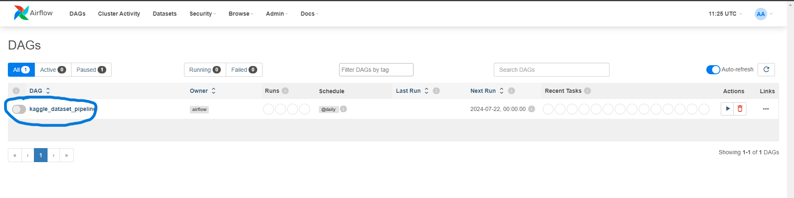

# Data Project 1 - Airflow ETL Pipeline 
***

## Table of Contents

- [Introduction](#introduction)
- [Setup Instructions](#setup-instructions)
- [User Guide](#user-guide)
- [Database Structure](#database-structure)
- [ETL Structure](#elt-structure)

## Introduction

The following is a document detailing the setup instructions, user guide and structure of an Apache Airflow ETL pipeline project.

The project extracts, transforms and loads the ['Netflix Movies and TV Shows'](https://www.kaggle.com/datasets/shivamb/netflix-shows) database from kaggle
into a containerised MSSQL instance. The final database is normalised to the 3rd normal form with no NULL values or duplicates present.
***

## Setup Instructions

### Install Requirements

Docker: [Install Docker Engine](https://docs.docker.com/engine/install/)

Python: [Python Releases](https://www.python.org/downloads/)

A database management programme: [SQL Server Management Studio](https://learn.microsoft.com/en-us/sql/ssms/sql-server-management-studio-ssms?view=sql-server-ver16) or 
[Azure Data Studio](https://learn.microsoft.com/en-us/azure-data-studio/download-azure-data-studio?tabs=win-install%2Cwin-user-install%2Credhat-install%2Cwindows-uninstall%2Credhat-uninstall)

'Pipeline' directory in this github repo: 

Kaggle.json file(requires a kaggle account): In [SETTINGS](https://www.kaggle.com/settings) scroll down and click 'Create New Token':

***
## User Guide
After all install requirements:

1. If desired, move 'Pipeline' directory into a different location such as 'Documents' or another more appropriate directory.
2. Using a CLI run the following code to deploy a MSSQL server with docker:   `docker run -e 'ACCEPT_EULA=1' -e 'MSSQL_SA_PASSWORD=yourStrong(!)Password' -p 1433:1433 --name sqledge -d mcr.microsoft.com/azure-sql-edge`   
_Ensure the password entered after `MSSQL_SA_PASSWORD` is noted down and follows the requirements detailed_ [HERE](https://learn.microsoft.com/en-us/azure/azure-sql-edge/disconnected-deployment) (if the CLI of choice is powershell use " instead of ' for the commands)
3. Move into the 'Pipeline' directory and create the custom docker image with:    `docker build -t airflow-sqlserver -f Dockerfile . --no-cache`
4. In the same directory run:    `docker compose up`   
 
After this set your docker container tab should look like this:    

5. Using a browser, navigate to 'localhost:8080'   
 
6. username: airflow, password: airflow:    
 
7. The initial landing page will have an import error as the connection and admin variables need to be set:    
     
 
8. Under connections click the '+' icon, input these details and save: 
If there is a specific database you want the data to be loaded into, input the database into 'Schema', otherwise the data
will be loaded into 'master'   
 
9. Under variables click 'choose file' and navigate to the kaggle.json file downloaded previously.   
 
10. Click import variables:    
 
11. On the home page activate the toggle to initiate the ETL process: )   
 
12. Reload the page and the DAG should be running and eventually complete successfully:    
 
13. The data should now be ingested and normalised in your database of choice: 

## Database Structure
The final product is normalised to the 3rd normal form as per the following ERD: 

## ETL Structure
The ETL uses Airflow to automate the extracting, transformation and loading of data with python into an MSSQL server datastore with 
the extraction, cleaning and loading done through python and normalisation of the database through SQL. 